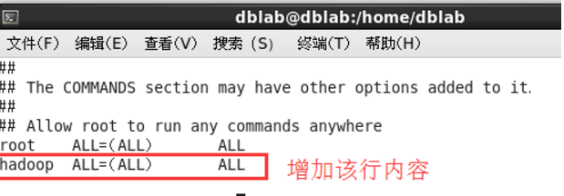
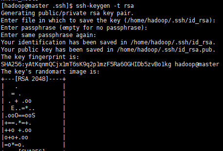
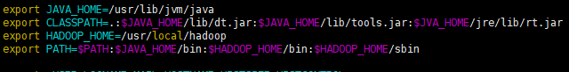
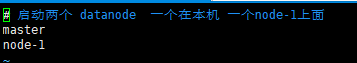
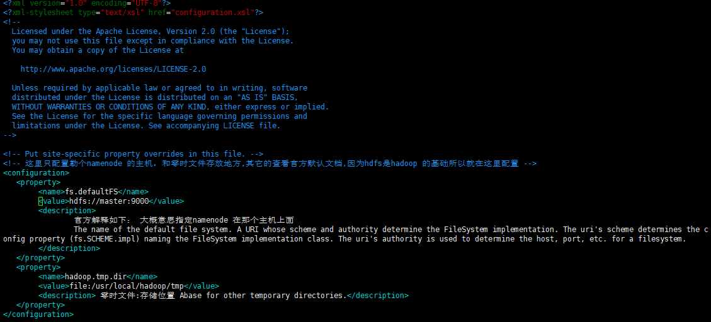
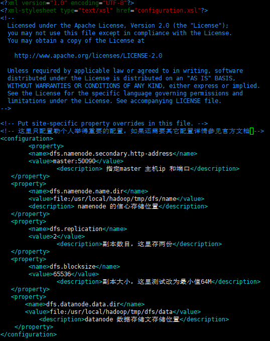
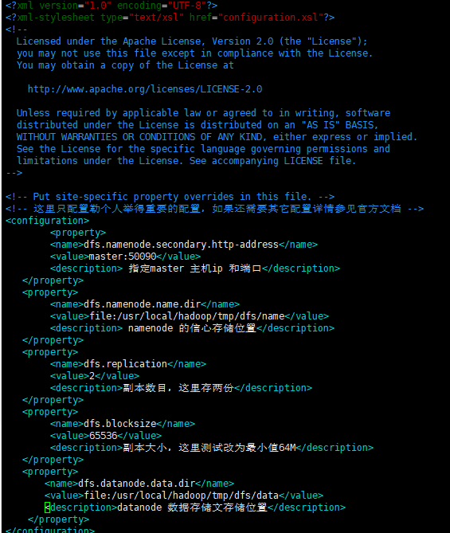

###hadoop安装步骤
 1. 创建hadoop用户
    * useradd -m hadoop -s /bin/bash    &nbsp;&nbsp;&nbsp;&nbsp;&nbsp;&nbsp;// 创建hadoop用户
    * passwd hadoop &nbsp;&nbsp;&nbsp;&nbsp;&nbsp;&nbsp;创建了可以登陆的 hadoop 用户，并使用 /bin/bash 作为shell
    * visudo 给hadoop赋权  等效于 vim /etc/sudoers
    
    
    * 配置hadoop免密码登陆
        1. rpm -qa | grep ssh   &nbsp;&nbsp; 查看是否安装勒SSH client、SSH server
        2. 如果没安装安装 sudo yum install openssh-clients sudo yum install openssh-server
        3. cd ~/.ssh/   &nbsp;&nbsp;# 若没有该目录，请先执行一次ssh localhost
        4. ssh-keygen -t rsa  &nbsp;&nbsp; # 会有提示，都按回车就可以 
        
        5. cat id_rsa.pub >> authorized_keys &nbsp;&nbsp; # 加入授权
        6. ssh-copy-id -i  ~/.ssh/id_rsa.pub root@192.168.168.202 
        7. chmod 600 ./authorized_keys &nbsp;&nbsp; # 修改文件权限
 2. 下载解压hadoop 
    * wget https://mirrors.tuna.tsinghua.edu.cn/apache/hadoop/common/hadoop-3.2.1/hadoop-3.2.1.tar.gz
    * tar -zxf  hadoop-3.2.1.tar.gz
    * 添加hadoop倒环境变量（只是为了方便启动hadoop 所以配置到环境变量）
        1. 配置 hadoop 倒环境变量&nbsp;&nbsp;vim /etc/profile 
        
        2. source profile 使 profile文件马上生效
 3. 配置hadoop 
    集群/分布式模式需要修改 /usr/local/hadoop/etc/hadoop 中的5个配置文件，更多设置项可点击查看官方说明，这里仅设置了正常启动所必须的设置项： slaves、core-site.xml、hdfs-site.xml、mapred-site.xml、yarn-site.xml 。
    * workers &nbsp;&nbsp; 
    
    * core-site.xml &nbsp;&nbsp; hadoop 核心环境的配置 
    
    * hdfs-site.xml &nbsp;&nbsp; 需要使用hdfs所以对hdfs 的配置如下 
    
 4. 复制配置文件到所有的子节点下面 
    
 5. 首次运行需要执行  hadoop namenode –format
