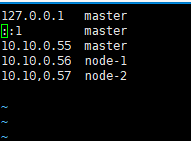

网卡设置
* nmtui
  
给linux 添加用户
* useradd -m hadoop -s /bin/bash  

创建了可以登陆的 hadoop 用户，并使用 /bin/bash 作为shell:
* passwd hadoop
* rpm -qa | grep ssh 查看安装的程序

免密码登陆
* ssh-keygen -t rsa -P '' -f ~/.ssh/id_rsa         #生成公共秘钥
* ssh-copy-id -i  ~/.ssh/id_rsa.pub root@192.168.168.202  #复制201的公钥到202机器上，这样就可以使用在201机器上免密码登录202机器了。

复制远程服务器的文件或文件夹到当前服务器的文件夹。
* scp -r hadoop@10.10.0.55:/usr/local/hadoop /usr/local/

刚修改的文件，系统马上生效
* source <文件名>  &nbsp;&nbsp;列:source profile
centos7修改主机名
* vim /etc/hosts 

给所有的用户赋读写执行权限
* chmod  -R a+w /usr/local/hadoop 

