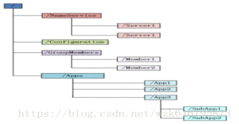
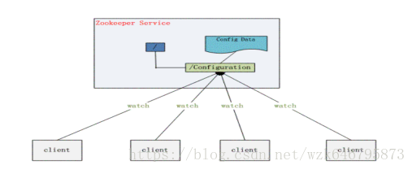
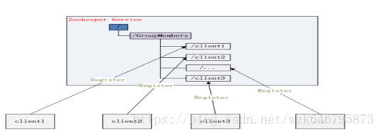
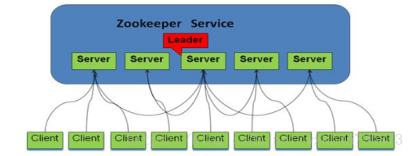

##zookeeper资料
### 1、 Zookeeper是什么？
分布、开源的应用程序协调服务,它是集群的管理者,监视着集群中各个节点的状态，根据节点的反馈进行下一步合理操作。主要解决分布式应用经常遇到的数据管理问题,如：统一命名服务、状态同步服务、集群管理、分布式应用配置项的管理等。

（Zookeeper 作为 Hadoop 项目中的一个子项目，是 Hadoop 集群管理的一个必不可少的模块，它主要用来控制集群中的数据，如它管理 Hadoop 集群中的 NameNode，还有 Hbase 中 Master Election、Server 之间状态同步等。）
### 2、Zookeeper提供什么？
Zookeepr提供文件系统及通知机制。

* 1 文件系统：zookeeper维护一个类似文件系统的数据结构:

每个子目录项如 NameService 都被称作为 znode，和文件系统一样，自由增加及删除，唯一不同其可存储数据。Znode分为四种类型

(1) PERSISTENT-持久化目录节点。（客户端与zookeeper断开连接后，该节点依旧存在)

(2) PERSISTENT_SEQUENTIAL-持久化顺序编号目录节点。（客户端与zookeeper断开连接后，该节点依旧存在，只是Zookeeper给该节点名称进行顺序编号）

(3) EPHEMERAL-临时目录节点（客户端与zookeeper断开连接后，该节点被删除）

(4) EPHEMERAL_SEQUENTIAL-临时顺序编号目录节点。（客户端与zookeeper断开连接后，该节点被删除，只是Zookeeper给该节点名称进行顺序编号）

* 1 通知机制：客户端注册监听它关心的目录节点，当目录节点发生变化（数据改变、被删除、子目录节点增加删除）时，zookeeper会通知客户端。

###3、Zookeeper能为我们做什么？
（1）命名服务：在zookeeper的文件系统里创建一个目录，即有唯一的path。在我们使用tborg无法确定上游程序的部署机器时即可与下游程序约定好path，通过path即能互相探索发现

（2）配置管理：把应用配置放置zookeeper上去,保存在 Zookeeper 的某个目录节点中，然后所有相关应用程序对这个目录节点进行监听，一旦配置信息发生变化，每个应用程序就会收到 Zookeeper 的通知，然后从 Zookeeper 获取新的配置信息应用到系统中就好。

 
（3）集群管理：节点（机器）增删及Master选取。节点增删：所有机器约定在父目录GroupMembers下创建临时目录节点，然后监听父目录节点的子节点变化消息。一旦有机器挂掉，该机器与 zookeeper的连接断开，其所创建的临时目录节点被删除，所有其他机器都收到通知：某个兄弟目录被删除，于是，所有人都知道：它上船了。新机器加入 也是类似，所有机器收到通知：新兄弟目录加入，highcount又有了。Master选取：所有机器创建临时顺序编号目录节点，每次选取编号最小的机器作为master就好

（4）分布式锁：基于zookeeper一致性文件系统,实现锁服务。锁服务分为保存独占及时序控制两类。保存独占：将zookeeper上的一个znode看作是一把锁，通过createznode的方式来实现。所有客户端都去创建 /distribute_lock 节点，最终成功创建的那个客户端也即拥有了这把锁。用完删除自己创建的distribute_lock 节点就释放锁。时序控制：基于/distribute_lock锁，所有客户端在它下面创建临时顺序编号目录节点，和选master一样，编号最小的获得锁，用完删除，依次方便。

（5）队列管理：分同步队列,FIFO队列（入队与出队），同步队列：当一个队列的成员都聚齐时，这个队列才可用，否则一直等待所有成员到达。在约定目录下创建临时目录节点，监听节点数目是否是我们要求的数目。FIFO队列：和分布式锁服务中的控制时序场景基本原理一致，入列有编号，出列按编号。

（6）分布式与数据复制：Zookeeper作为一个集群提供一致的数据服务，必然在所有机器间做数据复制。数据复制好处：
    
   * 容错：一个节点出错，不致于让整个系统停止工作，别的节点可以接管它的工作。
   * 提高系统的扩展能力：把负载分布到多个节点上，或者增加节点来提高系统的负载能力；
   * 性能提升：让客户端本地访问就近节点,提高用户访问速度。

###4、Paxos算法（数据一致性）
数据集群系统分：

（1）写主（writeMaster）,对数据的修改提交给指定的节点。读无此限制，可以读取任何一个节点。这种情况下客户端需要对读与写进行区别，俗称读写分离；

（2）写任意（对数据的修改可提交给任意的节点，跟读一样。这种情况下，客户端对集群节点的角色与变化透明。）对zookeeper来说，它采用的方式是写任意。通过增加机器，它的读吞吐能力和响应能力扩展性非常好，而写，随着机器的增多吞吐能力肯定下降（这也是它建立observer的原因），而响应能力则取决于具体实现方式，是延迟复制保持最终一致性，还是立即复制快速响应。

 原则：在一个分布式数据库系统中，如果各节点的初始状态一致，每个节点都执行相同的操作序列，那么他们最后能得到一个一致的状态。Paxos算法解决：保证每个节点执行相同的操作序列。 

 Paxos算法通过投票来对写操作进行全局编号，同一时刻，只有一个写操作被批准，同时并发的写操作要去争取选票，只有获得过半数选票的写操作才会被 批准（所以永远只会有一个写操作得到批准），其他的写操作竞争失败只好再发起一轮投票，就这样，在日复一日年复一年的投票中，所有写操作都被严格编号排序。编号严格递增，当一个节点接受了一个编号为100的写操作，之后又接受到编号为99的写操作（因为网络延迟等很多不可预见原因），它马上能意识到自己 数据不一致了，自动停止对外服务并重启同步过程。任何一个节点挂掉都不会影响整个集群的数据一致性（总2n+1台，除非挂掉大于n台）。
 
### 5、Zookeepr基本概念 
#### 5.1角色简介
 Zookeeper角色分为三类：
 
（1）领导者：负责进行投票的发起和决议,更新系统状态。

（2）学习者：
 
  ①跟随者：Follower用于接收客户请求并向客户端返回结果，在选中过程中参与投票。
  
  ②观察者：Observer可以接收客户端连接，将写请求转发给leader节点。但不参加投票过程,只同步leader状态。Observer目的在于扩展系统，提高读取速度。
 
（3）客户端：请求发起方。

 系统模型如图：
 
 
 
 
https://blog.csdn.net/wzk646795873/article/details/79706627
